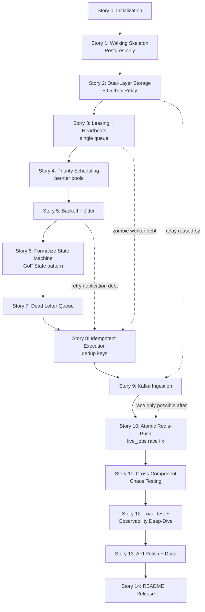
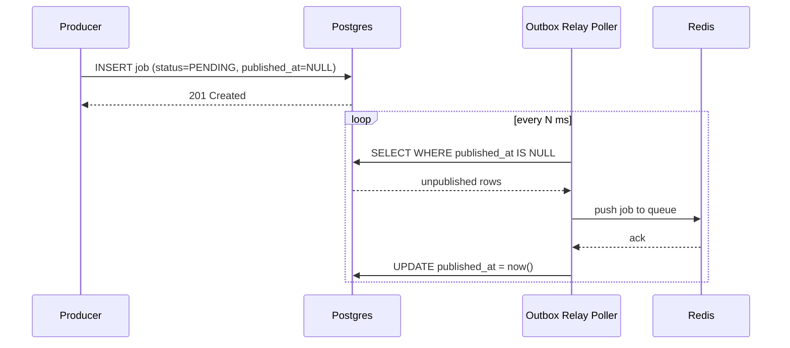
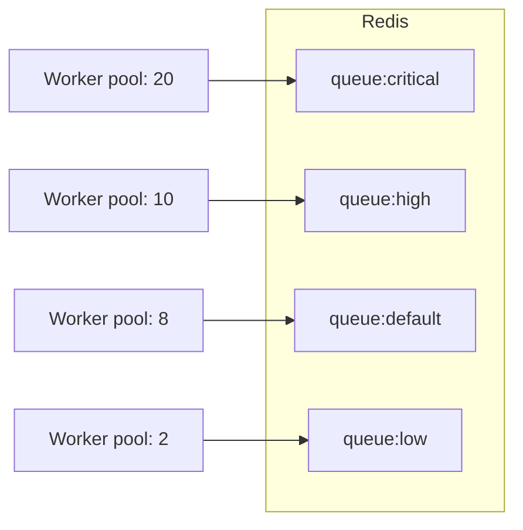
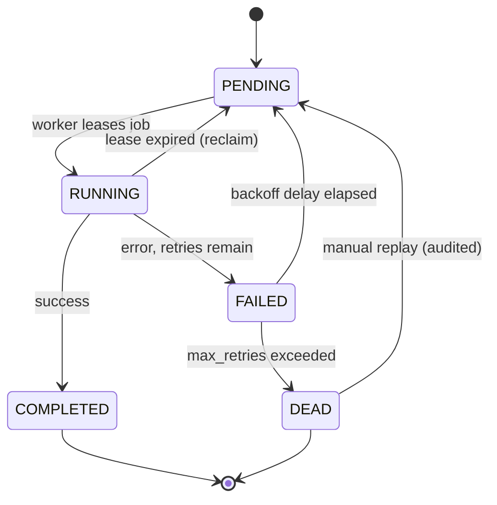
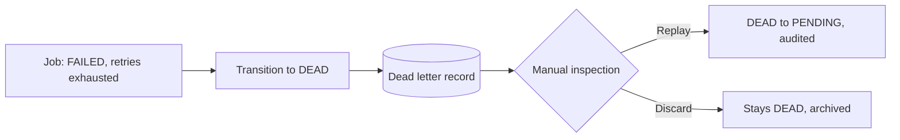
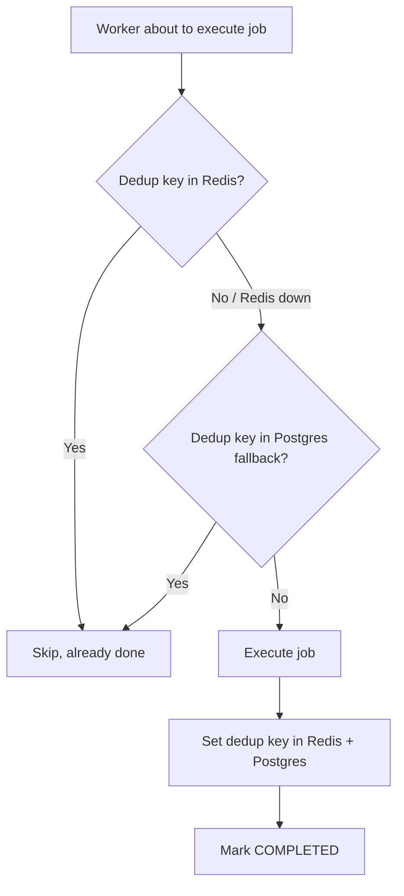
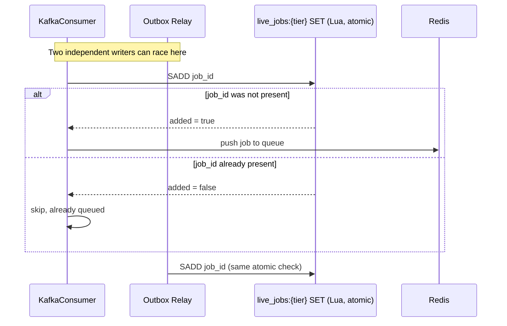

# NexusQ — Story Roadmap

> **How to use this file in a new chat:** Paste or attach this file and say something like *"I'm working on NexusQ Story 3, I want to learn more about Redis leasing"* or *"I just finished Story 1, review my work."* Everything needed to pick up the project from a cold start lives in this document — project context, locked architecture decisions, conventions, and every story's full breakdown.

---

## 1. Project context (read this first in a new chat)

**What NexusQ is:** a resilient distributed task queue built in Java/Spring Boot, designed as a high-signal resume project demonstrating production-grade distributed systems engineering — not just a working queue, but deep interview-readiness on every design decision, including the ones that were wrong at first and got corrected.

**Companion project:** FluxGuard (a distributed rate limiter), built in parallel. Not covered in this file.

**Locked architecture decisions (do not re-litigate these without good reason):**
- **Dual-layer storage:** PostgreSQL is the durable source of truth; Redis is the hot queue. Postgres-first write ordering, with an outbox-relay poller closing the gap where a Postgres write succeeds but the Redis push fails.
- **Job lifecycle:** five states — `PENDING`, `RUNNING`, `COMPLETED`, `FAILED`, `DEAD` — eventually formalized as a full class-per-state GoF State pattern (deliberately *not* built first — see Story 6).
- **Priority scheduling:** separate Redis queues per tier, each with its **own dedicated worker pool**. Not a single sorted-priority structure, not weighted picking — that approach relocates starvation instead of preventing it.
- **Idempotency:** two-layer dedup — Redis fast path + Postgres fallback (Redis-only dedup fails exactly when Redis is the failed component).
- **Kafka:** a second producer path alongside REST, reusing the same outbox-relay mechanism, not a replacement for it.

**Working conventions for the person building this (Ayush):**
- Sprint-style, one story in focus at a time. Parallel project switching (NexusQ ↔ FluxGuard) is fine; parallel *stories within* a project is not.
- Every story capped at ~3 hours total (research + implementation + testing), assuming Claude Code handles boilerplate generation.
- Every subtask capped at ~15 minutes, with explicit exceptions called out where test-harness setup costs more up front (cost amortizes across later stories).
- Every subtask is tagged **no-AI**, **AI-low**, or **AI-heavy** with a one-line reason. The test before accepting AI-generated code on anything touching concurrency, atomicity, or state transitions: *could I rewrite this from scratch right now without looking?* If no, trace it line by line before moving on.
- Every design decision (and every rejected alternative) gets a dated entry in `decisions.md`, written in the moment — not reconstructed later for interview prep.
- Interview-readiness is built **during** construction, not bolted on afterward.
- Tests are Definition of Done **per story** — not a separate testing phase at the end. The end-stage stories (11–12) are about cross-component integration chaos and a load-test deep dive, not "first time anything gets tested."

---

## 2. Full roadmap (dependency graph)



**Why this order, in one paragraph:** Stories 1–2 build the storage foundation before any worker logic exists. Stories 3–5 build leasing, priority, and retries against a *plain status string* on purpose — Story 6 only formalizes the GoF State pattern once every real transition has been discovered, instead of guessing at transitions in advance. Story 7 (DLQ) needs Story 6's formally-guarded `FAILED → DEAD` edge. Story 8 (idempotency) explicitly pays off debts left open by Stories 3 and 5, so it can't come before either. Story 9 (Kafka) adds a second writer into Story 2's relay; Story 10's race-condition fix only makes sense *after* that second writer exists — the race is between Kafka's redelivery path and the general relay sweep, and with only one writer there's no race to fix.

---

## 3. Status tracker

| # | Story | Status           | AI-tag mix |
|---|-------|------------------|------------|
| 0 | Initialization | -[x] Done        | mostly no-AI / AI-low |
| 1 | Walking skeleton (Postgres only) | -[x] Done        | mixed |
| 2 | Dual-layer storage + outbox relay | - [ ] Not started | mostly no-AI |
| 3 | Leasing + heartbeats | - [ ] Not started | mostly no-AI |
| 4 | Priority scheduling | - [ ] Not started | mixed |
| 5 | Backoff + decorrelated jitter | - [ ] Not started | mostly no-AI |
| 6 | Formalize state machine | - [ ] Not started | mostly no-AI |
| 7 | Dead Letter Queue | - [ ] Not started | mixed |
| 8 | Idempotent execution | - [ ] Not started | mostly no-AI |
| 9 | Kafka ingestion | - [ ] Not started | mixed |
| 10 | Atomic Redis-push hardening | - [ ] Not started | mostly no-AI |
| 11 | Cross-component chaos testing | - [ ] Not started | no-AI |
| 12 | Load testing + observability | - [ ] Not started | mixed |
| 13 | API polish + docs | - [ ] Not started | mostly AI-heavy/AI-low |
| 14 | README + release | - [ ] Not started | mostly no-AI |

*Update the checkbox and status column as you go. When you return in a new chat, point Claude at this table first.*

---

## Story 0 — Initialization

**Why this, why now:** nothing here is a design decision — it's a "does my machine actually work" checklist, kept deliberately separate from architecture thinking so a broken `docker compose up` never derails a session that should be about design.

**Depends on:** nothing. **Unlocks:** Story 1.

### Subtasks
- [x] **0.1** Verify/install Java 21+, Maven, Docker Desktop, Git on PATH — *10 min, no-AI*
- [x] **0.2** Create GitHub repo `nexusq`, default branch `main`, Java `.gitignore`, clone locally — *5 min, no-AI*
- [x] **0.3** Generate Spring Initializr project: Maven, Java 21, Spring Boot 3.x — Web, Data JPA, PostgreSQL driver, Data Redis, Kafka, Actuator, Validation, Lombok — *10 min, AI-low*
- [x] **0.4** First commit + push, confirm `mvn clean install` builds — *5 min, no-AI*
- [x] **0.5** Write `docker-compose.yml`: Redis, Postgres, Kafka (KRaft mode), named volumes, exposed ports — *15 min, AI-heavy — pure boilerplate*
- [x] **0.6** `docker compose up -d`, manually verify with `redis-cli ping`, `psql` connect, Kafka topic list — *10 min, no-AI — don't skip the manual check, it's what saves future debugging time*
- [x] **0.7** `application.yml` skeleton — datasource URL, Redis host/port, Kafka bootstrap servers, `local` profile — *10 min, AI-low*
- [x] **0.8** Add Testcontainers deps (Postgres, Kafka, Redis), write one smoke test spinning up all three — *10 min, AI-low*
- [x] **0.9** Create this `STORIES.md` and an empty `decisions.md` with the template below — *10 min, no-AI*
- [x] **0.10** Decide: single Maven module to start, or split now? **Recommendation: stay single-module until Story 6 or so forces a real seam.** Flag in decisions.md either way — *15 min, no-AI*

### Acceptance criteria
1. Fresh clone → `docker compose up -d` → `mvn spring-boot:run` takes under 10 minutes on a clean machine.
2. The Testcontainers smoke test passes via `mvn test`.
3. `STORIES.md` and `decisions.md` exist and are committed.
4. App starts cleanly; Actuator health endpoint returns `UP`.

### `decisions.md` template
```markdown
## [Date] — [One-line decision title]
**Decision:** What you chose
**Alternatives considered:** What else you looked at
**Why not:** Why you rejected the alternatives
**Revisit if:** Condition under which you'd reconsider
```

---

## Story 1 — Walking skeleton (Postgres only, no Redis yet)

**Why this, why now:** prove the thinnest possible vertical slice — submit, store, fetch — before any distributed-systems complexity is added. Staying Postgres-only here is deliberate: it lets you *feel* the failure window Redis will later fix, instead of being told about it abstractly.

**Depends on:** Story 0. **Unlocks:** Story 2.

### Subtasks
- [x] **1.1** `Job` entity + JPA repository: `id` (UUID), `payload` (jsonb), `status` (string), `priority` (string, unused until Story 4), `created_at`, `updated_at` — *15 min, AI-low*
- [x] **1.2** Flyway/Liquibase migration for the `jobs` table — *10 min, AI-heavy — pure DDL*
- [x] **1.3** `POST /jobs` — accepts payload, inserts `PENDING` row, returns job id — *15 min, AI-low*
- [x] **1.4** `GET /jobs/{id}` — returns current status + payload — *10 min, AI-low*
- [x] **1.5** A trivial single-thread polling worker using `SELECT ... FOR UPDATE SKIP LOCKED`, sets `RUNNING`, "processes" (sleep/log), sets `COMPLETED` — *20 min, no-AI — your first taste of concurrent row claiming; you'll replace this in Story 3, but write it yourself*
- [x] **1.6** Integration test: submit, poll until `COMPLETED`, assert final state — *15 min, no-AI — sets the testing pattern for everything after*
- [x] **1.7** Deliberately kill the worker mid-job, restart, confirm the job is now stuck `RUNNING` forever. Log this as a known, accepted gap in `decisions.md` — *10 min, no-AI — this is the failure-first ground rule in action*

### Acceptance criteria
- `POST /jobs` → `GET /jobs/{id}` returns `COMPLETED` within seconds under normal operation.
- Killing the worker mid-job leaves the job permanently stuck `RUNNING` — documented, not yet fixed.
- Integration test passes via Testcontainers.

### LLD principle
Keep the worker loop dumb on purpose. No interfaces, no abstraction yet — you don't know the real contract until Story 3 teaches it to you. Premature abstraction here is just guessing.

### Interview point
*"Why build this without Redis first?"* — lets you demonstrate you know exactly which failure mode Redis-as-queue solves, instead of reaching for it by reflex.

---

## Story 2 — Dual-layer storage + outbox relay

**Why this, why now:** introduce Redis as the hot queue, and close the Postgres-succeeds-Redis-fails gap with a relay poller. This is **general infrastructure** — every future producer (REST today, Kafka in Story 9) reuses this exact mechanism. Don't think of it as Kafka-specific plumbing; it isn't.

**Depends on:** Story 1. **Unlocks:** Story 3.

### Subtasks
- [ ] **2.1** Add nullable `published_at` timestamp column to `jobs` — *5 min, AI-heavy — pure DDL*
- [ ] **2.2** Redis config + a `JobQueueRepository` abstraction (push/pop, single tier for now) — *15 min, AI-low*
- [ ] **2.3** `POST /jobs` now writes Postgres only — `published_at` stays `NULL`, no direct Redis write — *10 min, no-AI — this ordering choice is the entire point of the story*
- [ ] **2.4** Build the outbox relay poller: scheduled task, `SELECT WHERE published_at IS NULL FOR UPDATE SKIP LOCKED`, push to Redis, `UPDATE published_at` — *20 min, no-AI — the core mechanism, write it yourself*
- [ ] **2.5** Worker now pops from Redis instead of polling Postgres directly; on pop, load full payload from Postgres — *15 min, AI-low*
- [ ] **2.6** Integration test: submit a job, kill Redis before the relay runs, restart Redis, confirm the relay still delivers it — *20 min, no-AI — first concurrency-adjacent failure test; this harness amortizes into Stories 3–10*
- [ ] **2.7** Remove the Story 1 stopgap worker logic — *10 min, AI-low*
- [ ] **2.8** Document the Postgres-first-vs-Redis-first write ordering decision in `decisions.md` — *10 min, no-AI*

### Acceptance criteria
- A job submitted while Redis is down is still delivered once Redis recovers and the relay's next scheduled run fires — zero manual intervention.
- No job can be popped by a worker before it has a durable Postgres row.
- The relay poller is idempotent — running it twice on the same row never double-pushes (write a test for this specifically).

### LLD principle
Consider a small `RelayTarget` interface even with only one implementation (Redis) today — Story 9 introduces a second thing that needs relaying. This is a judgment call, not a rule: if it feels like overkill right now, a single concrete class is fine, and you can extract the interface in Story 9 when the second case genuinely exists.

### Interview point
*"What does Redis solve here that Postgres alone doesn't?"* — dequeue throughput decoupled from job volume, not raw speed. Have ready: why a destructive `BRPOP` loses crash-safety unless leasing (Story 3) is layered on top anyway.



---

## Story 3 — Leasing + heartbeats (single queue)

**Why this, why now:** close the worker-crashes-mid-job failure window from Stories 1–2. You can't reliably distinguish a dead worker from a slow one over an async network — leasing reframes "detect death" into "detect prolonged silence," which is measurable.

**Depends on:** Story 2. **Unlocks:** Story 4. *(Debt paid off later by Story 8.)*

### Subtasks
- [ ] **3.1** Design the lease key schema: `lease:{job_id} → worker_id`, TTL = `lease_duration` — *10 min, no-AI — real design decision*
- [ ] **3.2** Lua script: atomic "claim job + set lease" — *15 min, no-AI — atomicity is the whole point, know every line*
- [ ] **3.3** Heartbeat renewal: worker extends lease TTL every `lease_duration / 3` — *15 min, no-AI*
- [ ] **3.4** Lease-expiry reaper: scheduled sweep finds `RUNNING` jobs with no live lease key, resets to `PENDING`, re-pushes — *20 min, no-AI — the "reaper" pattern reused in Story 5 and referenced again in Story 10*
- [ ] **3.5** Wire the worker loop to use lease-claim instead of plain pop — *15 min, AI-low*
- [ ] **3.6** Concurrency test: two workers race to claim the same job, assert exactly one wins — *20 min, no-AI — builds the multi-threaded test harness reused in Stories 4, 8, 10*
- [ ] **3.7** Failure-injection test: kill a worker mid-lease (no heartbeat), confirm the reaper reclaims within one lease window — *15 min, no-AI*
- [ ] **3.8** Decide and document actual `lease_duration` / `heartbeat_interval` numbers based on expected job runtime distribution — *10 min, no-AI*

### Acceptance criteria
- Exactly one worker ever successfully claims a given job under concurrent load.
- A worker killed mid-job results in reclaim and re-processing within one lease window, with no manual intervention.
- Heartbeat renewal never allows a duplicate claim mid-renewal (race test passes).

### LLD principle
Textbook Reaper/Janitor pattern. Keep the reaper as a separate scheduled component, not embedded in the worker loop — they have different failure tolerances; a slow reaper is fine, a slow worker isn't.

### Interview point
*"Why leasing instead of a liveness check?"* — async networks can't distinguish dead from slow. Have ready: *"what does leasing not solve?"* — the zombie-worker problem, which is exactly why idempotency (Story 8) is structurally required, not optional.

---

## Story 4 — Priority scheduling (per-tier queues + worker pools)

**Why this, why now:** prevent starvation of low-priority work without *relocating* the starvation instead of solving it. A single sorted-priority structure guarantees the top tier never starves — at the direct expense of every tier below it. That's the trap to avoid here.

**Depends on:** Story 3. **Unlocks:** Story 5.

### Subtasks
- [ ] **4.1** Generalize Redis queue keys to `queue:{tier}` for `critical`, `high`, `default`, `low` — *10 min, AI-low*
- [ ] **4.2** Generalize the relay poller and leasing Lua scripts to take a tier parameter — *15 min, AI-low*
- [ ] **4.3** Configurable worker pool sizes per tier via `application.yml` (e.g. critical=20, high=10, default=8, low=2) — *15 min, AI-heavy — pure config*
- [ ] **4.4** Each worker pool polls **only** its own tier's queue — no cross-tier fallback — *10 min, no-AI — get this wrong and you've silently rebuilt the naive single-queue design*
- [ ] **4.5** Add `tier` to the job submission API, validate against allowed values — *10 min, AI-low*
- [ ] **4.6** Load test: flood `critical`, confirm `low` still makes measurable, bounded forward progress (not starved to zero) — *20 min, no-AI — the test that actually proves the resume bullet*
- [ ] **4.7** Document the "bounded degradation, not zero degradation" guarantee and the rejected single-ZSET alternative in `decisions.md` — *10 min, no-AI*

### Acceptance criteria
- Under sustained `critical`-tier load, `low`-tier throughput never drops to zero — it degrades proportionally to its worker allocation, provably.
- Worker pools never cross tiers (test floods one tier, confirms idle workers in another tier don't pick up overflow).

### LLD principle
This is a **resource-pool-per-category (bulkhead)** pattern, not Strategy — don't force a pattern label that doesn't fit. "Bulkhead" (from resilience engineering / Hystrix terminology) is the accurate interview term: isolating resource pools so one category's overload can't exhaust another's capacity.



### Interview point
*"Why not a single ZSET sorted by priority?"* — you now have load-test numbers to back the starvation argument, not just the theory.

---

## Story 5 — Exponential backoff with decorrelated jitter

**Why this, why now:** a failed job needs to retry — but synchronized retries from many failures at once create a thundering herd. Jitter spreads retries out.

**Depends on:** Story 4. **Unlocks:** Story 6.

### Subtasks
- [ ] **5.1** Add `retry_count`, `max_retries`, `next_retry_at` columns — *5 min, AI-heavy — DDL*
- [ ] **5.2** Implement decorrelated jitter: `sleep = min(max_backoff, random_between(base, previous_sleep * 3))` — *15 min, no-AI — must be derivable from first principles in an interview*
- [ ] **5.3** Retry ZSET per tier, scored by `next_retry_at` — *15 min, no-AI — reuses the relay/reaper idiom from Stories 2 and 3*
- [ ] **5.4** Retry sweep: scheduled task pops due retries (`score <= now`), re-pushes to the tier's main queue — *15 min, AI-low — mechanical once 5.3 exists*
- [ ] **5.5** On failure: increment `retry_count`, compute `next_retry_at`, push to retry ZSET instead of immediate requeue — *15 min, no-AI*
- [ ] **5.6** Unit test: jitter formula never produces identical delays across repeated calls with the same input — *15 min, no-AI*
- [ ] **5.7** Integration test: fail a job 3 times, confirm increasing jittered delays, confirm retries stop past `max_retries` — *20 min, no-AI*
- [ ] **5.8** Document the full/equal/decorrelated jitter comparison and why decorrelated won, in `decisions.md` — *10 min, no-AI*

### Acceptance criteria
- A repeatedly failing job retries with measurably increasing, non-identical delays (no synchronized retry storms under simulated mass failure).
- A job exceeding `max_retries` stops retrying, left in a terminal failed state, ready for Story 7's DLQ.
- The retry ZSET sweep genuinely reuses Story 3's reaper pattern — verify this in review, don't just assume it.

### LLD principle
Strategy pattern fits well if you want pluggable backoff strategies (full jitter, equal jitter, decorrelated) — a real axis of variation, unlike Story 4's tiers.

### Interview point
Have the numeric walk-through ready (a concrete delay sequence for a specific base/max), plus the full-vs-equal-vs-decorrelated comparison.

---

## Story 6 — Formalize the job lifecycle state machine (GoF State pattern)

**Why this, why now:** this is a **refactor**, not new functionality. Stories 3–5 used a plain status string with scattered, implicit transition logic. Now that every real transition is known, replace it with one authoritative model that makes illegal transitions structurally impossible, plus an audit trail for SLA tracking.

**Depends on:** Story 5 (needs every transition discovered so far). **Unlocks:** Story 7.

### Subtasks
- [ ] **6.1** Enumerate every transition actually used by Stories 1–5 before writing any code — *10 min, no-AI*
- [ ] **6.2** Create the `JobState` interface + one class per state (`PendingState`, `RunningState`, `CompletedState`, `FailedState`, `DeadState`), each exposing only its legal transitions — *20 min, no-AI — the real design work, don't delegate it*
- [ ] **6.3** Add `job_state_transitions` audit table (immutable, timestamped rows) — *10 min, AI-heavy — DDL*
- [ ] **6.4** Wire every existing call site (leasing, reaper, retry sweep, completion handler) through `JobStateContext.transitionTo(...)` instead of direct status assignment — *20 min, AI-low — mechanical now the target API is designed, but review each call site*
- [ ] **6.5** Illegal transitions throw; test every illegal transition from 6.1's list is actually rejected — *15 min, no-AI*
- [ ] **6.6** Migration: backfill `job_state_transitions` for any in-flight jobs (good "how would I do this in production" exercise even on a fresh project) — *15 min, AI-low*
- [ ] **6.7** Document the table-driven-FSM-vs-class-per-state tradeoff and your stated preference, in `decisions.md` — *10 min, no-AI*

### Acceptance criteria
- Every transition anywhere in the codebase goes through the state machine — a grep for direct status assignment outside the state classes returns nothing.
- An illegal transition (e.g. `COMPLETED → RUNNING`) throws and is caught by a test.
- `job_state_transitions` has a row for every transition, queryable for "how long did this job spend in each state."



### LLD principle
Textbook GoF State pattern. Interview-ready distinction to own: table-driven FSM is simpler and fine for few states/transitions; full class-per-state earns its complexity when transitions carry real behavior (side effects, validation), not just a legal/illegal lookup. State it as a real tradeoff, not "State pattern is just better."

### Interview point
*"Why retrofit this instead of building it first?"* — honest answer: you didn't know the real transition set until you'd built the things that cause transitions, and formalizing too early risks designing for transitions that don't actually occur.

---

## Story 7 — Dead Letter Queue

**Why this, why now:** a `DEAD` job needs somewhere real to land. Without this, "the job is `DEAD`" is a status label, not a working escape hatch for poison-pill jobs.

**Depends on:** Story 6 (needs `FAILED → DEAD` as a formally guarded transition). **Unlocks:** Story 8.

### Subtasks
- [ ] **7.1** On `FAILED → DEAD`, write full failure context (last error, stack trace if available, retry history) to a `dead_letter_jobs` table or JSONB column — *15 min, AI-low*
- [ ] **7.2** `GET /dlq` — paginated list of dead jobs with failure context — *15 min, AI-low*
- [ ] **7.3** `POST /dlq/{id}/replay` — `DEAD → PENDING`, audited, resets `retry_count` — *15 min, no-AI — decide whether replay bypasses backoff on first attempt, and document it*
- [ ] **7.4** Quarantine-by-absence: prove a `DEAD` job is never picked up by any worker poll, queue pop, or retry sweep until explicitly replayed — *10 min, no-AI — write the test, don't assume it*
- [ ] **7.5** Test: flood with one genuine poison-pill job type alongside healthy jobs, confirm the poison pill reaches `DEAD` without degrading healthy throughput — *20 min, no-AI*
- [ ] **7.6** Document the manual-replay decision (and any auto-replay policy you deliberately didn't build) in `decisions.md` — *10 min, no-AI*

### Acceptance criteria
- A job that exhausts retries lands in the DLQ with enough context to diagnose why, without digging through logs.
- A DLQ'd job is provably inert until a human (or authenticated replay call) acts on it.
- Replaying a DLQ job is itself an audited transition, visible in `job_state_transitions`.



### LLD principle
Keep DLQ inspection/replay as a clearly separate API surface (e.g. `/dlq` namespace or `AdminController`) from producer-facing submission — different audience, different trust level, different auth posture.

### Interview point
*"What's the business case in one sentence?"* — stops one broken job from becoming either invisible data loss or a throughput problem for everyone else.

---

## Story 8 — Idempotent execution via dedup keys

**Why this, why now:** pays off two debts that are now real — Story 3's zombie-worker double-completion, and Story 5's at-least-once retry duplication. At-least-once delivery mathematically means *possibly more than once*; idempotency makes repeated execution safe rather than just less likely.

**Depends on:** Story 3 (zombie worker) and Story 5 (retry duplication). **Unlocks:** Story 9.

### Subtasks
- [ ] **8.1** Design the dedup key: `job_id`, or a caller-supplied idempotency key if client-side dedup matters too — decide and document why — *10 min, no-AI*
- [ ] **8.2** Redis fast path: atomic `SETNX`-with-TTL or Lua check-and-set before executing a job's side effect — *15 min, no-AI — atomicity is the entire point*
- [ ] **8.3** Postgres fallback table (`dedup_keys`: key, `completed_at`) for when Redis itself is the failed component — *15 min, no-AI*
- [ ] **8.4** Wire worker execution: check Redis → if absent, check Postgres fallback → if absent in both, execute, then write to both — *20 min, no-AI*
- [ ] **8.5** Concurrency test: simulate Story 3's exact zombie-worker scenario (two workers both attempt the same `job_id` near-simultaneously), assert the side effect fires exactly once — *20 min, no-AI — reuses the 3.6 test harness*
- [ ] **8.6** Failure-injection test: kill Redis, confirm the Postgres fallback still prevents duplicate execution — *15 min, no-AI*
- [ ] **8.7** Document why Redis-only dedup is insufficient (fails exactly when Redis is the failed component) — a gap you found yourself, make sure the writeup reflects that — *10 min, no-AI*

### Acceptance criteria
- Under a forced double-claim race (Story 3's exact failure mode), the side effect executes exactly once, provably under test.
- With Redis killed mid-test, duplicate execution is still prevented via the Postgres fallback.
- The dedup mechanism has zero domain knowledge of what the job actually does — a generic "has this key been seen" primitive, not job-type-specific logic.



### LLD principle
A check-and-set/memoization pattern at the infrastructure layer, deliberately decoupled from business logic — the job handler shouldn't need to know idempotency exists. If you want a pattern name: Decorator, wrapping execution.

### Interview point
The non-idempotent `chargeCard(customerId, 50)` vs idempotent "ensure a $50 charge exists for job X" framing — clearest way to explain this to a non-distributed-systems interviewer too.

---

## Story 9 — Kafka-based job ingestion

**Why this, why now:** add a second, bursty/high-volume producer path that doesn't fit naturally-rate-limited REST traffic (batch imports, upstream event emitters) — without duplicating Story 2's dual-layer storage logic.

**Depends on:** Story 2 (reuses the outbox relay), Story 8 (dedup-aware). **Unlocks:** Story 10.

### Subtasks
- [ ] **9.1** Kafka consumer config + topic setup — *15 min, AI-heavy — pure wiring*
- [ ] **9.2** Consumer logic: on message receipt, `INSERT` into `jobs` with `published_at = NULL` — reuses Story 2's relay exactly as-is from here on — *15 min, AI-low*
- [ ] **9.3** Unique constraint on `(kafka_topic, kafka_partition, kafka_offset)` to protect against duplicate Postgres inserts on consumer redelivery — *10 min, no-AI — explain why offset-based uniqueness, not content hashing*
- [ ] **9.4** Consumer acknowledgment strategy: commit offset only after the Postgres insert succeeds (at-least-once, never at-most-once) — *15 min, no-AI*
- [ ] **9.5** Integration test: produce a message, force redelivery (don't commit offset), confirm the unique constraint prevents a duplicate row — *20 min, no-AI*
- [ ] **9.6** Integration test: confirm a Kafka-sourced job flows through the existing relay → Redis → worker → completion path with **zero new code** in that path — *15 min, no-AI — proof Story 2's reuse actually worked*
- [ ] **9.7** Document why Kafka and REST coexist rather than Kafka replacing REST, in `decisions.md` — *10 min, no-AI*

### Acceptance criteria
- Kafka consumer redelivery never produces a duplicate Postgres row (constraint-backed, not just "unlikely").
- A Kafka-sourced job is indistinguishable from a REST-sourced job once it lands in Postgres — same relay, same queues, same workers.
- No new race condition has been introduced *yet* — that's explicitly Story 10's job, not this one's.

### LLD principle
This is the moment the optional `RelayTarget` interface from Story 2 either earns its keep or doesn't. If Kafka's consumer writes through the exact same relay abstraction, that's the payoff. If you ended up duplicating logic instead, note that honestly in `decisions.md` too — it's still a useful data point.

### Interview point
*"Isn't Kafka just a message queue?"* — no, it's an append-only log; many independent consumers can read the same stream at their own pace, which a destructive-pop queue structurally can't support.

---

## Story 10 — Atomic Redis-push hardening (the live_jobs race fix)

**Why this, why now:** two independent writers now exist — the outbox relay (Story 2) and Kafka's consumer-redelivery path (Story 9) — and they can race to push the same job to Redis concurrently. Neither writer currently checks the other's actions. **This race literally cannot exist before Story 9.**

**Depends on:** Story 9. **Unlocks:** Story 11.

### Subtasks
- [ ] **10.1** Trace the actual race scenario end to end on paper first: which two code paths can both push job X, under what timing — *15 min, no-AI — do this before touching code, it's the real insight*
- [ ] **10.2** Design the `live_jobs:{tier}` Redis SET — one per tier, tracking job_ids currently pushed/in-flight — *10 min, no-AI*
- [ ] **10.3** Write the atomic Lua script: `SADD job_id` to `live_jobs:{tier}`, only proceed with the Redis push if the SADD reports a newly-added member — *15 min, no-AI — the core mechanism*
- [ ] **10.4** Retrofit Story 2's relay poller to call this script before every push — *10 min, AI-low*
- [ ] **10.5** Retrofit Story 9's Kafka redelivery path to call the same script — *10 min, AI-low*
- [ ] **10.6** Remove `job_id` from `live_jobs:{tier}` once the job reaches a terminal state or is reclaimed, so the set doesn't grow unbounded — *15 min, no-AI*
- [ ] **10.7** Concurrency test: simulate both writers pushing the same `job_id` within milliseconds of each other, assert exactly one push reaches Redis — *20 min, no-AI — reuses the race-test harness from Stories 3 and 8*
- [ ] **10.8** Document the two rejected alternatives (Postgres flag with origin-based branching; live three-structure check) and why the atomic SET won on correctness and performance grounds respectively — *15 min, no-AI*

### Acceptance criteria
- A simulated simultaneous double-push from both writer paths results in exactly one job entering the Redis queue, provably under a race test.
- The fix is origin-agnostic — it doesn't know or care whether the caller is the relay or the Kafka path, meaning a third future writer is automatically safe too.
- `live_jobs:{tier}` memory stays bounded under sustained load (no leaked entries for completed jobs).



### LLD principle
This generalizes "push to Redis" into one idempotent primitive used by every writer. Name the refactor explicitly: you're not patching two known bugs, you're making an operation idempotent by construction so any future writer is safe by default.

### Interview point
This is your strongest "I found a real distributed-systems bug through first-principles reasoning, not because something broke in front of me" story. Walk through the three crash scenarios (Kafka down, Postgres down, Redis down, and combinations) that led you here.

---

## Story 11 — Cross-component chaos testing

**Why this, why now:** every story above already has its own unit/integration/concurrency tests as Definition of Done. This story is specifically about combined, multi-component failures that no single story's tests would catch.

**Depends on:** Story 10 (everything must exist first). **Unlocks:** Story 12.

### Subtasks
- [ ] **11.1** Kill Redis and a worker simultaneously mid-job; confirm full recovery once both return, no manual intervention — *20 min, no-AI*
- [ ] **11.2** Kill Postgres while jobs are in flight in Redis; confirm workers fail gracefully (not silently) and recover once Postgres returns — *20 min, no-AI*
- [ ] **11.3** Flood Kafka with a redelivery storm while the relay poller is also under load; confirm Story 10's fix holds under real concurrency, not just the unit-level race test — *20 min, no-AI*
- [ ] **11.4** Kill a worker holding a lease on a critical-tier job while critical tier is fully saturated; confirm reclaim still happens within `lease_duration` despite contention — *15 min, no-AI*
- [ ] **11.5** Write each scenario up as a short runbook entry (what was killed, what was expected, what actually happened) — doubles as interview material — *20 min, no-AI*

### Acceptance criteria
- All four scenarios recover to a consistent, correct state with zero manual intervention beyond restarting the killed component.
- Each scenario has a written runbook entry.

### Note
If a scenario fails here, the fix belongs back in whichever earlier story's component is actually broken — not bolted on in this story.

---

## Story 12 — Load testing + observability dashboard deep-dive

**Why this, why now:** every story has had lightweight per-story metrics as Definition of Done. This is the deep dive — real load profiles, real dashboards, real numbers for your README.

**Depends on:** Story 11. **Unlocks:** Story 13.

### Subtasks
- [ ] **12.1** Write a k6 or Gatling script simulating realistic mixed-tier submission load — *15 min, AI-low*
- [ ] **12.2** Run it, capture baseline throughput/latency per tier — *15 min, no-AI — interpreting these numbers is the actual skill*
- [ ] **12.3** Wire Micrometer counters/timers: jobs submitted, completed, retried, DLQ'd, lease contention rate, queue depth per tier — *20 min, AI-heavy for simple counters, no-AI for anything derived*
- [ ] **12.4** Stand up a simple Grafana dashboard (or just document metric names if you don't want to maintain Grafana long-term) — *20 min, AI-heavy*
- [ ] **12.5** Re-run the load test with the dashboard up, capture numbers/screenshots for the README — *15 min, no-AI*
- [ ] **12.6** Document actual throughput achieved and any bottleneck found (relay poller interval, lease contention at high concurrency) in `decisions.md` — *10 min, no-AI*

### Acceptance criteria
- A documented, repeatable load test produces concrete throughput/latency numbers per tier.
- Dashboards/metrics exist for every major system property (queue depth, lease contention, retry rate, DLQ rate) — not just "is the app up."

---

## Story 13 — API polish, error handling, OpenAPI docs

**Why this, why now:** the system works — now make it presentable. This is what a reviewer or interviewer actually clicks through first.

**Depends on:** Story 12. **Unlocks:** Story 14.

### Subtasks
- [ ] **13.1** Consistent error response contract (code, message, timestamp) across all endpoints — *15 min, AI-low*
- [ ] **13.2** Request validation (payload size limits, required fields, tier enum) with clear 400 responses — *15 min, AI-heavy*
- [ ] **13.3** OpenAPI/Swagger annotations across all controllers — *15 min, AI-heavy*
- [ ] **13.4** Rate-limit or auth consideration specifically on the `/dlq` admin endpoints — *10 min, no-AI — a real security decision, not boilerplate*
- [ ] **13.5** Manual pass: hit every endpoint via Swagger UI, confirm it behaves as documented — *15 min, no-AI*

### Acceptance criteria
- Swagger UI is fully navigable; every endpoint can be exercised from it.
- Malformed requests return clear, consistent 400s rather than 500s.

---

## Story 14 — README, decisions.md polish, demo script

**Why this, why now:** the resume-facing deliverable. This is what a hiring manager or interviewer actually reads.

**Depends on:** Story 13. **Unlocks:** nothing — this is the finish line.

### Subtasks
- [ ] **14.1** Architecture README: the dual-layer model, the full story-by-story build narrative, key diagrams pulled from this file — *30 min, no-AI — your own words, this is your interview prep*
- [ ] **14.2** A "what breaks and what happens" section, pulled directly from Story 11's runbook entries — *15 min, AI-low for formatting, no-AI for content selection*
- [ ] **14.3** Polish `decisions.md` into a clean, scannable reference (review every entry, tighten wording) — *20 min, no-AI*
- [ ] **14.4** A short demo script / curl collection showing the system end to end, including one deliberate failure-and-recovery demo — *20 min, AI-low*
- [ ] **14.5** Final read-through: does this look like the project a senior engineer would build? — *15 min, no-AI*

### Acceptance criteria
- A stranger could clone the repo, follow the README, and have the system running plus understand its key design decisions within 15 minutes.
- `decisions.md` reads as a coherent design journal, not a scattered changelog.

---

## 4. Quick reference — AI-tag legend

| Tag | Meaning |
|-----|---------|
| **no-AI** | Write/design this yourself. Touches concurrency, atomicity, or state transitions, or is a real design decision worth owning. |
| **AI-low** | AI can draft it, but review every line — mechanical once the design is already decided. |
| **AI-heavy** | Pure boilerplate, wiring, or config translation. Safe to let AI generate freely. |
